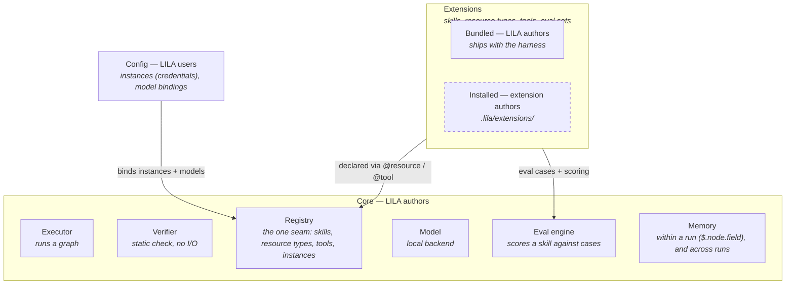

# Lean Intelligent Local Agent (LILA)

## Introduction

LILA is an opinionated *vehicle* (harness + model) that focuses on **privacy**, **explicit execution**, and **efficiency**. The harness is 100% local, and the model is 100% local, so your data does not need to leave your computer.

### Problem

Most current AI agent harnesses encode skills as natural language instructions and operate in a loop of *message* -> *thinking through* -> *taking action* -> *observing* -> *more thinking* -> *more actions* until it thinks it's complete. 

While this setup optimizes for ease of getting started and one-off use cases, its lack of structure - which leads to opacity by design - makes reliability and trust hard to earn, because the same task can run differently when repeated, small wording changes may alter behavior, and trying to figure out what went wrong means reading a chat transcript.

Most importantly, the unstructured accrual of messages and outputs into the context window as a task progresses necessitates a large, and often remote, language model - how comfortable are you with the E-mail to your therapist being a line item on someone else's training or eval dataset? 

For such harnesses, visibility isn't built in - it's bolted on after the fact.

### Why LILA?

LILA approaches agent harness from a different philosophy - using graphs to bring structure to interactions and tasks. Agent interaction happens on a graph. Skills are defined in graphs - you can compile your natural language skills to a graph if you wish.

What do you get?

- **Local runs, 100% private** - because interactions decompose into smaller nodes, a smaller model can handle work normally reserved for bigger ones.
- **Debuggability** - A graphical representation is easier to digest than chat logs.
- **Predictability / trustworthiness** - Run the same task twice, get the same shape of result.

## Deep Dive

### Architecture

### Terminology / Concepts

| Term | Explanation | 
| ---- | ----------- |
| Graph | A structure consisting of nodes and edges. In LILA, this is often a directed graph, meaning edges have directions. |
| Node | One unit of work: an LLM call, a tool call, an invocation of another skill, and more. |
| Edge | A directed link carrying an optional `when` predicate. |

| Concepts | Explanation |
| -------- | ----------- |
| Run | One execution of a skill, with its own working memory (addressable by `$.<node>.<name>`) and history record. |
| Skill | An execution graph. Synonymous to workflows in other harnesses. A skill has an identity, versions, declared resources, and is invocable by name. | 
| Resource | A live handle to information living outside the graph, e.g. credentials, configuration, decryption key. Store information that should be kept out of graph state in a resource. |
| Tool | Named operation, may operate on resources. |
| Extension | A unit of extensibility and distribution, which may include resources and skills. |

### Node Types

| Type | What it does | Args |
| ---- | ------------ | ---- |
| `llm` | One model call, constrained output | Prompt template, output schema |
| `tool` | One tool call, on a declared resource or on nothing | `resource` (omit for a pure tool), `call`, `args`. |
| `skill.run` | Run another graph by name | `ref` contains the graph reference, or `graph:` for inline, `input`: for the arguments to the skill, and `resources` to declare the list of required resources. |

### Extensions

Extensions are GitHub packages with a `lila.toml` file at the root, and contains three folders - `code`, `skills`, and `evals`. `code` is what the extension implements; `skills` and `evals` are what it declares.

#### Code

`code` declares the resource types, and the tools that the skills in this extension may use. A tool that takes a resource as its first parameter operates on it; a tool that takes none is *pure* - it reaches nothing outside its arguments, needs no binding, and needs no stub to replay.

#### Skills

`skills` contains the YAML files that describe the skill graphs that this extension provides.

#### Evals

`evals` contain the evaluations, as well as results performed against the skills in this extension. This strengthens trust in skills that are shared between many users.

The responsibility for evals is as such - LILA provides the engine, and skill authors provide the datasets and wiring.

#### Notes

- No cross-extension references. If you need a resource or skill from another extension, fork it. This removes the need for a PyPi/NPM-like dependency solver.

### Current Limitations

- **Untrusted content ingested into graphs is unresolved**. Malicious websites and E-mails read into the graph could steer certain skills down undesirable (but not necessary catastrophic) directions. Currently it's the responsibility of the skill owner to design for this.
- **Trust boundary is install**. Currently third-party Python extensions run in the same process as the main process. I am planning to sandbox this in the future.
- **Resources ref points to a specific type owned by a specific publisher**. If there are two publishers with IMAP resources and tools, there is no mechanism (e.g. via an interface) to reconcile the two. Switching from one to another means that the graph may need editing as well. This UX gap is left for future improvements.

## Random Thoughts & Long-Term Vision

### What About Open-Ended Tasks?

The harnesses such as OpenClaw and Hermes treat tools as atomic units and lets models operate freely over them. This optimizes for open-ended tasks because it gives the model freedom to choose how to proceed and which tools to use. 

A graph-first approach is basically the opposite - we start with the constrains, then figure out how to loosen it. And this approach has the implicit thesis that the tasks benefiting from constraints are more economically valuable than the ad-hoc open-ended tasks (I'm not claiming that this is true, and this may vary across different settings and definitions of "economically valuable").

Once you realize that a loop can be expressed on a graph, you see the connection between the two ends, and the question becomes: what does a a balanced design look like?

### Incorporating Continual Learning

Context is not memory. Bringing episodes into context does not feel scalable. Maybe there is way to RL episodic and preferential memory into the model?
