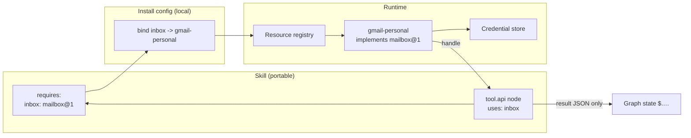
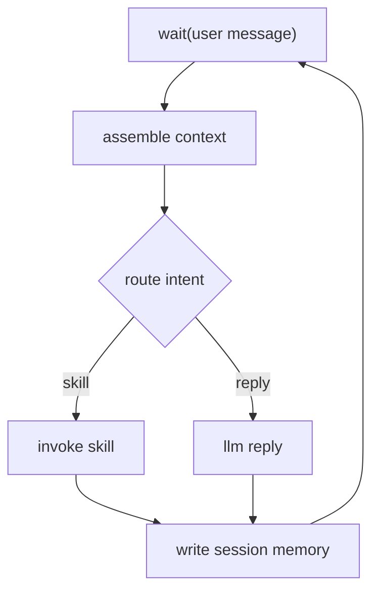

# Workflow Executor Thin-Slice

**Status**: on-going — proposals below are unreviewed.

## Goal

A thin-slice executor that runs a workflow expressed as a graph, proven by an e-mail
triage workflow as its first consumer.

The executor is the deliverable. The e-mail workflow is the forcing function: it has
to be re-shapeable without touching the executor, so the workflow itself stays
something to experiment with.

**In**: node types, edge routing, typed state, resources, run record, read-only Gmail.
**Out**: sending mail, conversation/`wait`, retries, parallel, sub-skills, persistence.
Proof is a real (isolated) Gmail inbox, triaged correctly, repeatably.

## Terminology (unreviewed — naming still open)

| Term | Means |
|---|---|
| Graph | the one structural noun: nodes + edges + metadata in a flat file |
| Skill | a graph that is published — identity, version, slots, invocable by name |
| Node | one unit of work: a model call or a transport call |
| Edge | a directed link carrying an optional `when:` predicate |
| Run | one execution of a graph, with its own memory and record |
| Run memory | the working-memory tier for a run, addressed `$.path`, append-only per node |
| Resource | a named object (mailbox, DB, browser) injected into a node, never in memory |
| Slot | a resource dependency a graph declares, addressed `$.name` like anything else |
| Binding | the install-time mapping of a slot to a concrete resource |
| `skill.run` / `graph.run` | synonyms — one node type that runs another graph, published or local |
| Record | the per-run log of nodes, edges, and resources used |
| Nested skill | a skill run from another skill's `skill.run` node |

Retired: "fragment" — it read as a third kind of thing alongside node and skill, when a
nested skill is just a skill. Settled: `skill.run` and `graph.run` are two spellings of
one node type, not two types — `ref:` takes a published `name@version` or a local path
and the executor treats both the same. `skill.run` is canonical in normalized output and
error messages; `graph.run` is accepted because a local graph does not feel like a
published skill at the call site. Retired: `$slots.` — one prefix, `$.`, for everything a
graph can name: slots, `$.input`, and node outputs share it. A slot resolves to the bound
resource handle rather than to a stored value, so resources never serialize into memory
or the record.
Slot names and node ids therefore share one namespace and must not collide — a static
check, same as the existing unique-node-id one.

## Proposals

### P1 — Node types

| Type | Does | Config |
|---|---|---|
| `llm` | one model call, constrained output | prompt template, output schema, optional tool grants |
| `tool.mcp` | `tools/call` on an MCP server | server resource, tool name, args |
| `tool.api` | HTTP request | connection resource, method, path, body |
| `tool.local` | in-process callable | registered name, args |

`tool.*` share one execution contract — JSON args in, JSON result out, one validation
and record path — while each keeps its own config schema. Adding a transport is an
adapter, not a branch in the executor. Deferred: `wait`, `parallel`, `code.execute`.

### P2 — Routing on edges

No condition node. Each edge carries a predicate over memory; the executor takes the
first match and records the edge with the evaluated inputs. Branch history is
reconstructable from edges alone.

**Edges are evaluated top-down, so file order is semantics.** In the example below,
`classify -> draft` is listed before `classify -> end`, so `== "reply"` is tested first
and the unguarded edge acts as the fallback. Reordering them changes behavior; a `when:
true` edge listed early makes every edge under it dead. Static check should flag
unreachable edges.

### P3 — Run memory and schemas

Run memory is one JSON-serializable bag per run, addressed as `$.path.to.value` — the
working-memory tier of the hierarchy below, not a separate mechanism. It differs from
the longer-lived tiers in *access discipline*: written only as validated node output,
read only by exact path. Nothing is model-initiated or semantic, which is what keeps a
run replayable.

Every node declares
input and output JSON Schema; outputs validate on write, so a bad node fails at its own
boundary. An `llm` node's output schema is the same artifact that constrains decoding.
The graph declares its own input/output schema — that is what makes it invocable by
name and composable as a sub-skill later.

Author-facing shorthand that compiles to JSON Schema is a later convenience, not now.

### P4 — Resources

A resource is a named, capability-scoped object resolved at run start and injected into
a node's execution context. It never enters graph state, so credentials never reach a
prompt, the run record, or `$.…`.



### P5 — Nested skills

No third noun. Everything is a skill — a graph with identity, version, and resource
slots — and a skill can run another via a `skill.run` node. The stdlib `tool-call` skill
(`llm(choice) → edges → tool.* → project`) is a skill like any other; it just isn't one
a user would invoke directly.

| Level | Is |
|---|---|
| Node | atomic — one model call or one transport call (`llm`, `tool.mcp`) |
| Skill | a graph of nodes, optionally running nested skills |

Nesting is what keeps nodes atomic without losing the pattern. Merging `llm` + `tool`
into one node would hide a bounded mini-loop inside a node the executor cannot see; as a
nested skill it stays visible.

**Open problem — skill proliferation.** Fine-grained nesting means many small skills, and
a large flat set is hard for a model to select from. Scoping note: most selection is
static, done by the graph at authoring time, so this only bites where a model chooses —
the interaction graph's router. Directions to explore: exposure (internal skills never
enter a selection set), routing in stages rather than one flat choice, or retrieval over
skill descriptions instead of listing them all.

**Recursion** is the executor's property, not a kind of skill (nothing calls itself). The
run unit is recursive from day one — a node handler may itself be a skill run with its
own memory scope and nested record. Free now, a rewrite to retrofit, even though nothing
nests in the slice. `parallel` then needs no new machinery: map over a list, one child
run per item, results collected at `$.<node_id>`.

**Isolation rule**: an inner graph cannot reach outer context. Everything crossing the
boundary is explicit — `input:` for memory, `resources:` for slots — and nothing is
inherited ambiently. The parent reads the child's result at `$.<node_id>` after it
returns; the child never reads up. That makes inputs a real contract rather than an
ambient read of whatever the parent happened to have, and it keeps a skill file honest
about which resources it touches.

```yaml
- id: triage
  type: skill.run
  ref: email-triage@1
  resources:
    inbox: $.inbox             # parent hands its binding down, by name
  input:
    message_id: $.list.ids[*]
```

Paths must be uniquely indexed across nesting — node ids unique within a graph,
qualified by the instance (`$.triage.gather.notes`).

If a nested skill needs the trained transcript shape (`assistant(tool_call) → tool →
assistant`), the message list lives in its memory at a declared path, so it stays
inspectable instead of hiding inside a node.

### P6 — Composability of vended skills

A vended skill can't know local resource names, so it declares a **slot** with a
required shape (`inbox: mailbox@1`) and the user binds that slot to a concrete instance
at install time. Same pattern for tools: a skill depends on a capability contract, not
an endpoint.

DX: installing a skill lists its unbound slots and refuses to run until each is bound;
`mailbox@1` is a versioned interface the runtime can typecheck a binding against.
Open: where interface definitions live, and whether a skill may ship a default binding.

## File format

Highest user touch point and the hardest thing to change later, so worked through in
more detail. A graph is a flat file — metadata, `nodes`, `edges` — in YAML (JSON is the
same document).

```yaml
skill: email-triage
version: 1

requires:                      # resource slots, bound at install
  inbox: mailbox@1

input:                         # the graph's own contract
  type: object
  properties:
    message_id: { type: string }
  required: [message_id]
output:
  type: object
  properties:
    route: { enum: [reply, no_action, flag] }
    draft: { type: string }
  required: [route]

entry: fetch

nodes:
  - id: fetch
    type: tool.api
    uses: inbox                # resource slot, not a URL
    call: get_message
    args:
      id: $.input.message_id
    out:
      type: object
      properties:
        from:    { type: string }
        subject: { type: string }
        body:    { type: string }

  - id: gather                 # a graph in a node position
    type: skill.run
    ref: lila/tool-call@1
    input:
      email: $.fetch

  - id: classify
    type: llm
    model: default             # bundled model alias, never a file path
    prompt: |
      From: {{ $.fetch.from }}
      Subject: {{ $.fetch.subject }}

      {{ $.fetch.body }}

      Context: {{ $.gather.notes }}
    out:                       # also the decoding constraint
      type: object
      properties:
        route:  { enum: [reply, no_action, flag] }
        reason: { type: string }
      required: [route, reason]

  - id: draft
    type: llm                  # no model: — omitted means the `default` alias
    prompt: ...
    out:
      type: object
      properties:
        text: { type: string }
      required: [text]

edges:
  - { from: fetch,    to: gather }
  - { from: gather,   to: classify }
  - { from: classify, to: draft, when: $.classify.route == "reply" }
  - { from: classify, to: end,   when: true }
  - { from: draft,    to: end }

return:                        # memory -> the graph's declared output
  route: $.classify.route
  draft: $.draft.text
```

Load-bearing choices in that sketch:

| Choice | Consequence |
|---|---|
| A node's output appends to `$.<node_id>` | unique node ids give unique memory indexing for free; no separate `store:` field, and re-execution never overwrites — see "Repeated execution" |
| `out:` is both schema and decoding constraint | one artifact, no drift between what is asked for and what is validated |
| Edges hold `when:`, evaluated top-down, `true` as the fallback | routing reads as a list; no condition nodes — but file order is semantics, see P2 |
| `end` is a reserved target, `return:` projects memory to output | a graph's contract is visible without reading its nodes |
| `uses:` names a slot; `model:` names an alias | no endpoint, credential, or weight path in a shared file |

Statically checkable before a run: node ids unique, edges reference real ids, every
`$.` path resolves against a declared schema, every slot bound, entry reachable and
`end` reachable from every node. That check is most of what a dry-run means.

**Repeated execution.** A node does not run once. A ReAct-style loop revisits the same
`llm` and `tool` nodes until it exits, so `$.<node_id>` is a history, not a cell:

| Address | Is |
|---|---|
| `$.classify` | sugar for `$.classify[-1]` — the latest execution |
| `$.classify[-2]` | the execution before it |
| `$.classify[0]` | the first |
| `$.classify[*]` | every execution, in order |

Nothing is overwritten, so a loop's whole trajectory stays addressable while it runs and
inspectable after — the record and run memory are the same structure rather than two
that can disagree. Defaulting to `[-1]` keeps the common read short and keeps every
`when:` in a loop reading "as of now", which is what routing wants.

Two things that follow:

- Indices are execution order **within the current scope**. A nested run keeps its own
  history: `$.triage[-1].gather[-2]`. So an inner loop's iterations never renumber an
  outer node.
- A map node executes **once** and returns a list, so `$.map[-1]` is the whole list.
  "Ran N times" and "returned N items" stay distinguishable, which they would not be if
  a map spliced its iterations into the parent's history.

Open: retention. A long loop's history is unbounded. Everything lands in the record;
whether run memory keeps all of it or keeps a window with the dropped entries readable
only from the record is a memory-pressure call, not a semantics one.

**Stubbing nodes.** Testing a graph means pinning what a node returns without calling a
model or a network. Stubs live in a separate file keyed by node id, never in the skill —
a skill file should not carry test scaffolding to whoever installs it.

```yaml
# stubs/triage-happy-path.yaml
classify: { route: reply, reason: "asks a question" }   # every invocation
fetch:                                                  # per invocation, in order
  - { from: a@example.com, subject: "one", body: "…" }
  - { from: b@example.com, subject: "two", body: "…" }
```

Semantics, borrowed from pytest fixtures: a scalar answers every invocation, a list is
consumed in order. Running past the end of a list is an **error** by default — that is
precisely the signal a loop iterated more times than the test expected — with an
explicit opt-in to repeat the last value for loops whose length is not the thing under
test. Each value validates against the node's `out:` schema on the way in, so a stale
fixture fails at load instead of propagating a wrong shape downstream.

A run record already holds every node's output in order, which is the same structure a
stub file is. Replay is then not a second mechanism: point the executor at a past record
and it is a full stub set.

**Nested skills — reference vs inline.** Both are supported and both land output at
`$.<node_id>`, so memory addressing does not depend on the choice:

```yaml
  - { id: gather, type: skill.run, ref: lila/tool-call@1, input: { email: $.fetch } }

  - id: gather
    type: skill.run
    input: { email: $.fetch }
    graph:
      entry: ...
      nodes: [...]
      edges: [...]
```

`ref` is the default — it versions, it is vendable, and it keeps a skill one page.
Inline is for a one-off that reuse would not justify. Open: whether `ref` resolves by
path, by registry name, or both, and how a ref pins a version.

**One expression language.** `{{ }}` looked like a second language next to `$.`. The fix
is not to delete the braces but to delete the language: inside `{{ }}` only a `$.` path
is legal. No filters, no arithmetic, no `#if`/`#each`, no conditionals. Prose needs a
boundary marker that a YAML scalar does not provide, so the braces stay in `prompt:`;
every structured field (`args:`, `input:`, `when:`, `return:`) takes a bare `$.` path
with no braces. One grammar, one resolver, one static check over both.

What that bans is real, and graph structure already covers most of it: `#if` is an edge
with a `when:`, `#each` is a map node. What is left over is value shaping — joining a
list into a bulleted string, reformatting a date. A `transform` node is the obvious home
for it, and `tool.local` may already be that node: a registered in-process callable is a
transform. Inline Python is the version that needs real thought (sandboxing,
determinism, a reproducible run), so it stays later work rather than a design decision
taken now.

Unresolved and worth chewing on:

- `$.classify.route` reads redundantly when a node is named after what it produces.
  Node naming convention matters more than expected.
- Whether `when:` is a real expression language or a small fixed predicate set. A full
  expression language is a large surface to keep deterministic and typecheckable.

Later: define the interaction graph in the same format, so conversation is authored the
same way a skill is.

### P7 — Run record

Per node: inputs read, output written, resources used (by name), timing, model usage.
Per edge: predicate, evaluated inputs, taken or not. Enough to localize a failure to a
node and replay the run.

## How tools reach the prompt

The backend does two things and neither is execution: it **renders** tool schemas into
the prompt where the model was trained to see them, and **parses** the generated call
text back into structured `tool_calls`. The caller executes and appends the result as a
`tool` message. Same split as LangGraph's `bind_tools` (render/parse) vs `ToolNode`
(execute).

For `qwen3.5:9b` the rendering is not a Go template — its modelfile declares
`RENDERER qwen3.5` / `PARSER qwen3.5`, compiled into ollama
(`model/renderers/qwen35.go`), so `ollama show --template` is useless. That renderer
puts tools in a leading system turn (`# Tools … <tools>` + JSON per tool + a
format postamble), appends any user system prompt *after* it, emits calls as
`<tool_call><function=NAME><parameter=…></function></tool_call>`, and returns results
as `<tool_response>`.

Consequences:

- Pass `tools` through the API; never hand-format them. `Model` today sends messages
  only — tool support means adding `tools` to the request and parsing `tool_calls` off
  the response.
- An `llm` node does not fully own its prompt layout; the renderer decides where system
  content sits relative to tools.
- Renderers are per-model and have known bugs (Qwen3.5 tool serialization, unclosed
  `</think>`). Pin the backend version and record it in the run record.

### How a graph grants tools

An `llm` node **never executes anything** — that stays the executor's invariant. It emits
calls into `$.<node_id>.tool_calls`, a `tool.*` node consumes them, and edges route on
whether a call was emitted at all. That is the stdlib `tool-call` skill, and it is why
merging the two into one node was rejected in P5.

But the model still has to know which tools exist, and per the consequence above that
means the API's `tools` parameter, never prose in the prompt. So an `llm` node takes a
`tools:` list of **references**, resolved the way `ref:` is — a registry `name@version`
or a local path — with the argument schema derived from the referenced declaration
rather than inlined at the call site:

```yaml
  - id: think
    type: llm
    tools:
      - lila/search@1
      - $.inbox.send            # a bound slot's operation
    prompt: ...
```

That is tools-as-an-extension, the same registry shape as skills: a capability contract
with a versioned argument schema, bound at install. Grants being per-node also gives the
record something exact to log — which tools were exposed to which call, not which tools
the graph could have used.

**One-tool variant.** When the tool is known at authoring time, skip `tools:` entirely:
the `llm` node's `out:` *is* the argument schema, and the api node reads `$.<node_id>`
and calls with it. Same pipeline, one candidate tool, no dependence on the model's
native tool-calling — the model is only doing constrained decoding, which it already
does everywhere else in a graph. Worth supporting alongside the general form, because
the bundled model set is small and fixed and its tool-calling quality is a known risk
(see the renderer bugs above).

## Runtime — short vs long term

Ollama is a thin-slice convenience, not the plan. The shipped product is 100%
self-contained: LILA bundles the inference runtime and one or two fixed models that the
maintainer updates.

Implications to work through:

- Render/parse becomes LILA's job. Ollama's value is knowing each model's exact trained
  wire format; dropping it means owning that per bundled model — which is tractable
  precisely because the model set is fixed and pinned.
- Model + renderer + parser version together, so a run is reproducible.
- The `Model` protocol is the seam that keeps the swap cheap — nothing above it should
  learn what a backend is.
- Open: bundling and weight distribution (size, licensing, update channel), and whether
  an embedded runtime or a supervised local daemon.

## Sketch — goal #2, conversation as a graph

Postponed, recorded so the design doesn't paint it out. The argument for it is memory:
graph state *is* working memory, so context becomes constructed rather than accumulated,
and a retrieval node states what it fetched and why. A transcript-shaped loop can't be
diffed; this can — and that is what keeps a small model viable.



| Tier | Lifetime | Written by | Read by |
|---|---|---|---|
| Node I/O | one node | — | declared schema |
| Run | one run | node output, validated | exact path `$.…` |
| Session | one conversation | explicit write node | exact key or scan |
| Long-term | across sessions | explicit write node | retrieval with declared query |

**Interrupts**: only the interaction graph has this problem — skill graphs run async on
workers. No true mid-node interrupt is needed; it only has to *look* like one. Other
node types are short enough to finish, so the single case is aborting an `llm` node's
stream: discard the partial output, record the node as interrupted, cancel the run.

A mid-run message means one of three things — abort, amend, or an unrelated request.
A loop conflates them; here an interrupt-handler node classifies with constrained
output, which is visible and testable. The aborted run's memory summarizes into session
memory so the restart is not amnesiac.

**Sessions**: keyed by channel + peer + thread, so Slack/Telegram/SMS don't collapse
into one unbounded conversation. Two ways to bound it — close a session on idle or turn
cap, or let it run unbounded and lean on hierarchical memory to summarize upward. The
second is more interesting and is the reason to build the memory hierarchy first.
